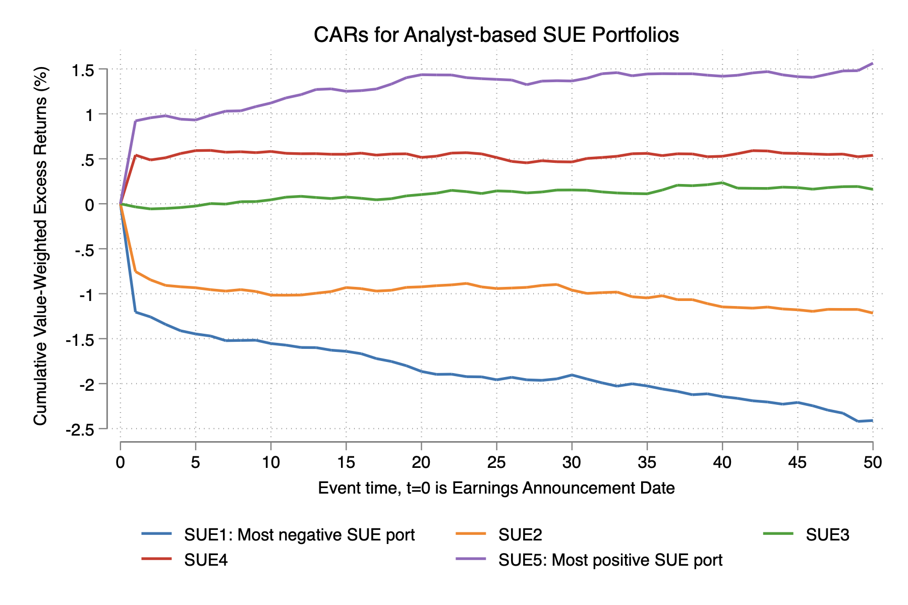

# Replicate Post-Earnings Announcement Drift (PEAD)

### Description

This code creates earnings surprise measurement and replicates post-earnings announcement drift with I/B/E/S, Compustat, and CRSP datasets. I follow the code given by WRDS (see the [article here](https://wrds-www.wharton.upenn.edu/pages/support/applications/portfolio-construction-and-market-anomalies/post-earnings-announcement-drift/)) and write the stata code from the original SAS code. After the merge, the final sample contains 410, 966 firm-quarters with non-missing information in all three datasets from 1983Q3 to 2022Q1. 

### PEAD formed by analyst forecast-based measure (SUE3) 

## 

$$ \text{SUE3} = \frac{\text{Actual EPS } - \text{ Median estimate within the 90 days prior to the announcement}}{\text{price per share at the end of quarter t}} $$

